<p align="center">
  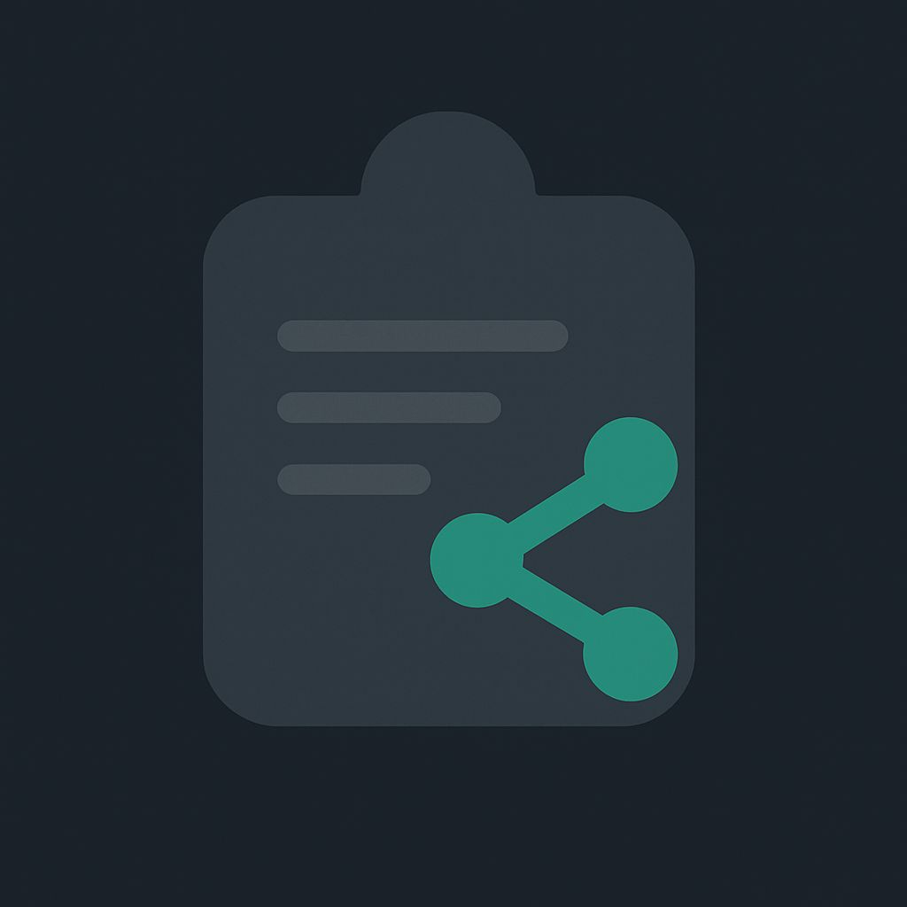
</p>

# ClipShare

**ClipShare** is a modern application for **fast file and data sharing between devices**. It uses *
*Peer-to-Peer (P2P) connections** to transfer data directly between devices without relying on a
central server.

---

## Screenshots

| Mobile                                 | Desktop                                |
|----------------------------------------|----------------------------------------|
| 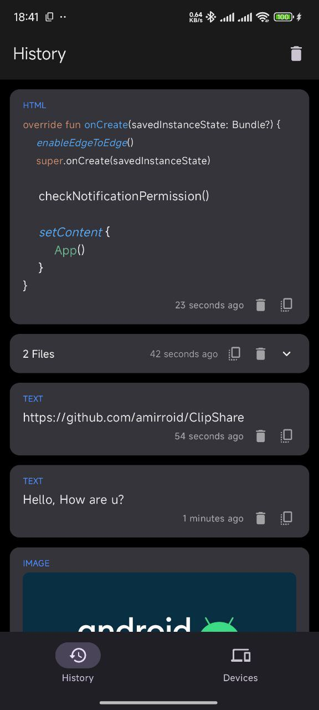 | 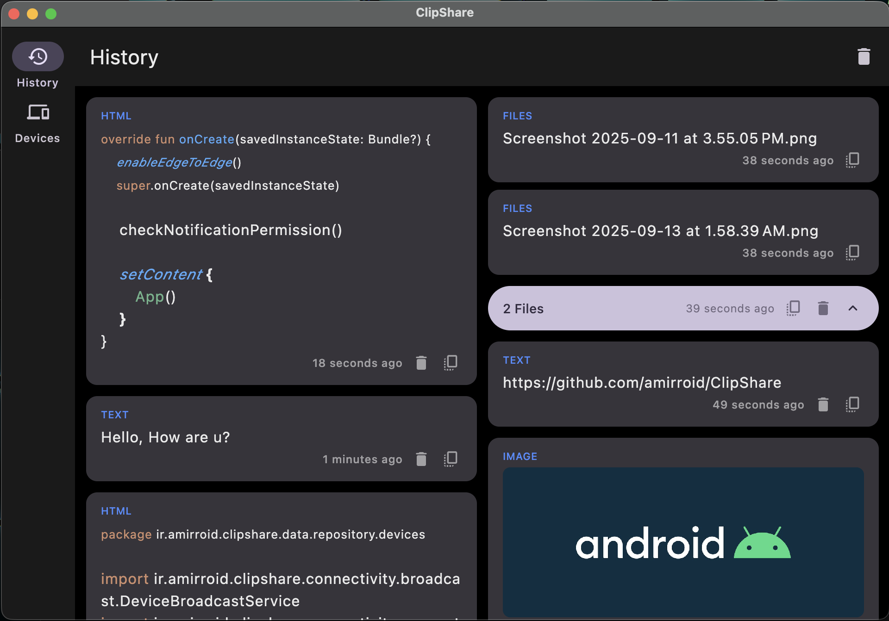 |
| 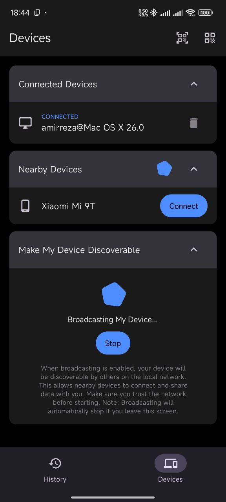 | 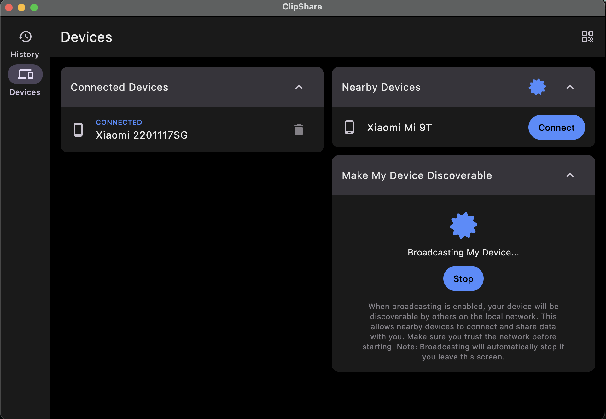 |
| 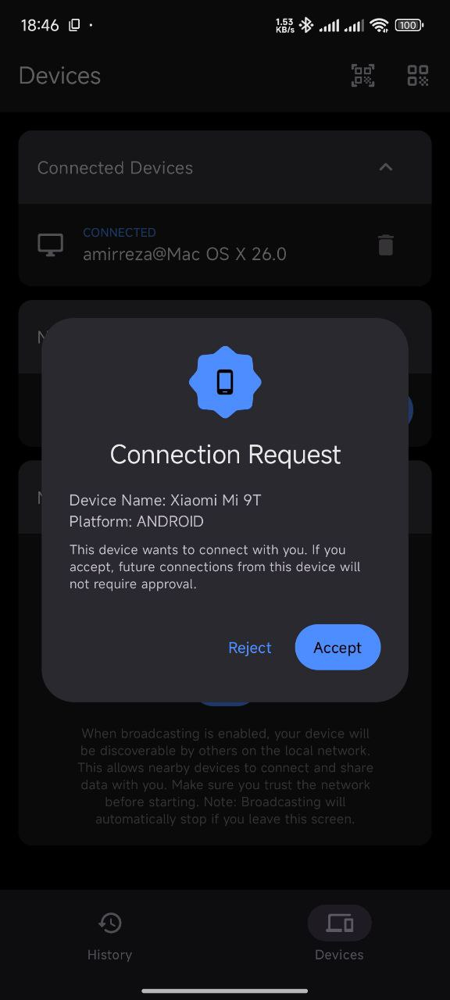 | 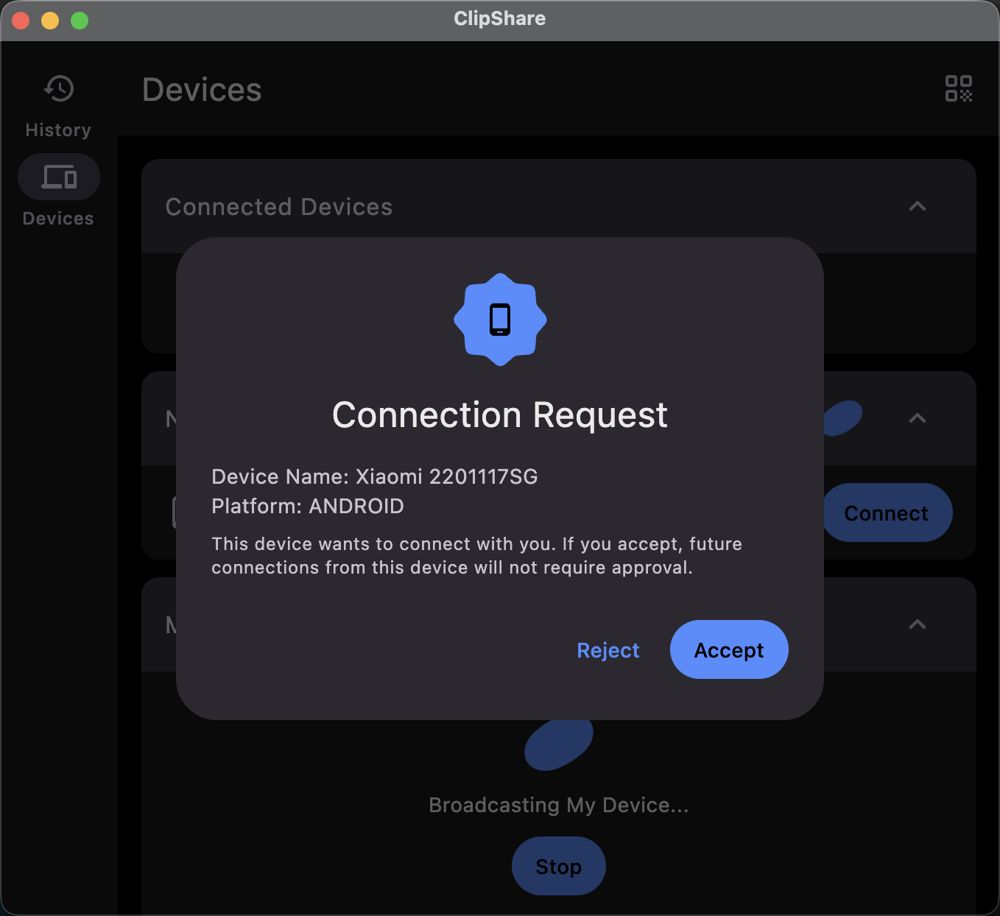 |
| 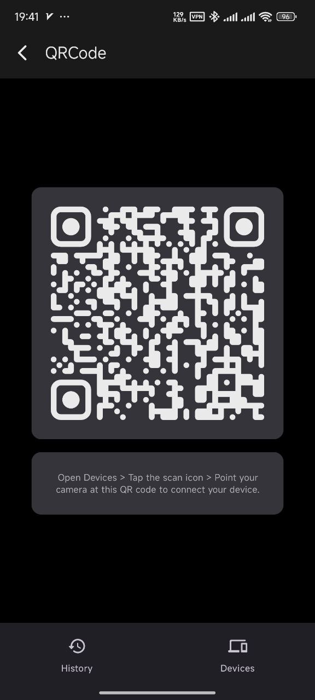 | 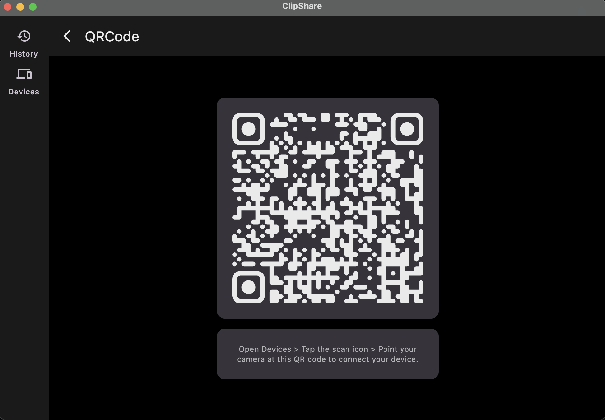 |
| 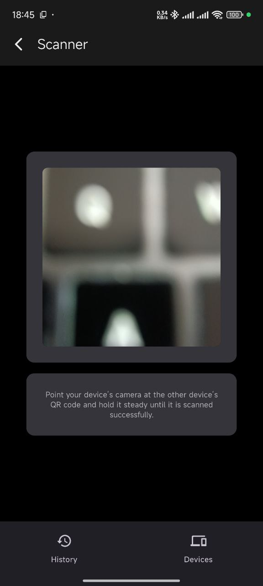 | Not supported on desktop               |
| 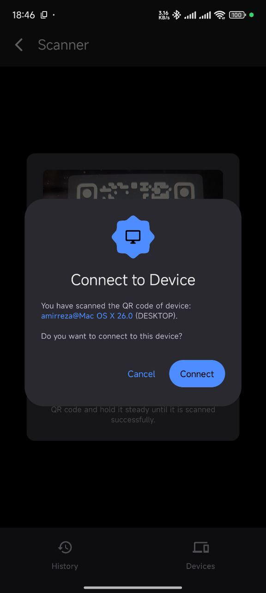 | Not supported on desktop               |

---

## Project Structure

**`composeApp/`** – Main Compose Multiplatform application entry point
**`core/`** – Core modules for app functionality

* `data/` – Data sources and repositories
* `database/` – Local database access
* `design-system/` – UI components and theming
* `di/` – Dependency injection setup
* `domain/` – Business logic
* `navigation/` – Navigation graph and routing
* `process/` – Background services (connectivity, clipboard, storage)
* `resources/` – Static resources
* `ui-models/` – UI data models

**`features/`** – Feature modules (Screens)

* `devices/` – Device discovery and management UI
* `history/` – Transfer history UI
* `qrcode/` – QR code generation and scanning
* `scanner/` – Scanner UI for QR codes

**`shared/`** – Shared modules

* `clipboard/` – Clipboard integration
* `common/` – Shared utilities and Compose helpers

    * `app/` – App-level utilities
    * `compose/` – Compose UI helpers
* `connectivity/` – Signaling, UDP, WebRTC management
* `network/` – Ktor configuration
* `storage/` – Local storage handling

---

## How it Works

1. **Device Discovery**
   ClipShare discovers nearby devices using **UDP sockets**. Each device broadcasts its presence and
   listens for other devices.

2. **Signaling Server**
   To establish a **WebRTC connection**, ClipShare uses a lightweight **signaling server** to
   exchange **SDP information** and ICE candidates.

3. **Peer-to-Peer Connection**
   After SDP exchange via the signaling server, a **direct P2P WebRTC connection** is established
   for sending files, messages, and data directly between devices.

4. **Background Processes**
   The `process` module handles background tasks, binding services like connectivity, clipboard
   monitoring, and storage management to ensure smooth operation.

---

## Features

* Direct P2P file sharing without a central server
* Local network device discovery using UDP
* Reliable data transfer over WebRTC
* Lightweight signaling server for connection setup
* Background service management for clipboard, storage, and connectivity

---

## Contributing

We welcome contributions! Here’s how you can help:

1. **Fork the repository**
2. **Create a new branch**:

   ```bash
   git checkout -b feature/my-feature
   ```
3. **Make your changes**
4. **Commit your changes**:

   ```bash
   git commit -m "Add my feature"
   ```
5. **Push to your branch**:

   ```bash
   git push origin feature/my-feature
   ```
6. **Open a Pull Request** on the main repository

Please follow existing styles and include documentation where needed.

---

## License

This project is licensed under the MIT License. See the [LICENSE](LICENSE) file for details.
